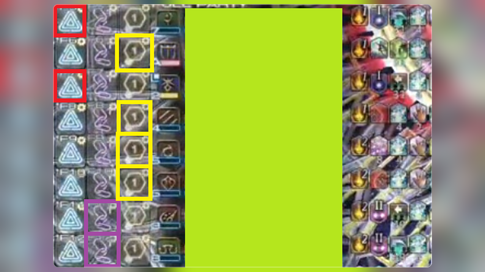

# Goetia

[English](README.md)



Goetia は、**手動マーカー補助**用の Dalamud プラグインです。パーティリスト順（`<1>`–`<8>`）に合わせ、Attack / Bind / Stop のホットバースロットをハイライトします。

`/mk` マクロは、割り当てたホットバーに自分で配置する必要があります。モジュールがマークを提案すると、対応スロットに枠が表示されます。`/mk` 自体は発行しません。

- 設定でホットバーを割り当てる
- 使うモジュールを有効にする
- 戦闘中、ハイライトされたマクロでマークする

## インストール

1. `/xlsettings` を実行し、**試験的機能**タブを開く
2. **カスタムプラグインリポジトリ** に次の URL を追加する:

```
https://raw.githubusercontent.com/exatrines/DalamudPlugins/refs/heads/main/pluginmaster.json
```

3. `/xlplugins` を実行し、**Goetia** をインストールする

## 機能

- **ホットバーハイライト** — パーティリスト順に Attack / Bind / Stop のホットバーを割り当て、ルールごとに枠の色と太さを設定できます。
- **Preview オーバーレイ** — 必要なら表示します。パーティのスロットとホットバーの対応、どのモジュールがハイライトしているかを確認できます（メインの Eye で開き、× でオフ）。

## モジュール

- **Run Dynamis Delta** — Near/Far World → Stop
- **Run Dynamis Sigma** — Near/Far World → Stop。Dynamis ×1 のあと残りを Attack
- **Run Dynamis Omega** — FirstInLine 消滅後に Half1 → Half2

## コマンド

| コマンド | 説明 |
| --- | --- |
| `/goetia` | メイン画面（モジュール一覧）の表示切替 |
| `/goetia settings` | プラグイン設定画面の表示切替（`config` / `s` も可） |

## 開発者向け

1. ビルド: `dotnet build Goetia.sln -c Release -p:Platform=x64`
2. Dalamud の **dev plugin** パスを `Goetia/bin/Release/` に向ける
3. プラグインインストーラ（dev）で **Goetia** を有効化

共有 UI キットとして [MirageUI](https://github.com/exatrines/MirageUI) を git サブモジュールで同梱しています。

## ライセンス

[AGPL-3.0-or-later](LICENSE)
