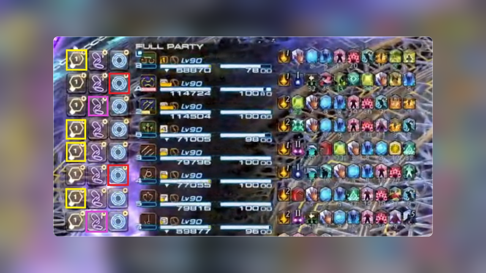

# Goetia

[日本語](README.ja.md)



Goetia is a Dalamud plugin for **manual mark assist**. It highlights Attack / Bind / Stop hotbar slots in party HUD order (`<1>`–`<8>`).

Place `/mk` macros on the assigned hotbars yourself. Map those bars in settings, enable the modules you need, and mark from the highlighted slots during combat. Goetia never issues `/mk`.

## Install

1. Run `/xlsettings` and open the **Experimental** tab
2. Add this URL under **Custom Plugin Repositories**:

```
https://raw.githubusercontent.com/exatrines/DalamudPlugins/refs/heads/main/pluginmaster.json
```

3. Run `/xlplugins` and install **Goetia**

## Features

- **Hotbar highlighting** — Maps Attack / Bind / Stop hotbars to party HUD order, with per-rule outline color and thickness.
- **Preview overlay** — Optional overlay of party seats and hotbars, and which module is driving highlights (open from the main window Eye; close with × to turn off).

## Modules

TOP (The Omega Protocol):

- **Run Dynamis Delta** — Near/Far World → Stop
- **Run Dynamis Sigma** — Near/Far World → Stop; Dynamis ×1 (max 2), then remaining → Attack
- **Run Dynamis Omega** — Half1, then Half2 after FirstInLine clears. Near/Far → Stop; Dynamis stacks → Bind; remaining → Attack

DSR (Dragonsong's Reprise):

- **Wrath of the Heavens** — Thunderstruck → Stop
- **Wroth Flames** — Spreading Flames → Attack; Entangled Flames → Bind; remaining → Stop

## Commands

| Command | Description |
| --- | --- |
| `/goetia` | Toggle the main window (module list) |
| `/goetia settings` | Toggle plugin settings (`config` / `s` also work) |

## For developers

1. Build: `dotnet build Goetia.sln -c Release -p:Platform=x64`
2. Point Dalamud’s **dev plugin** path at `Goetia/bin/Release/`
3. Enable **Goetia** in the plugin installer (dev)

[MirageUI](https://github.com/exatrines/MirageUI) is included as a git submodule for the shared UI kit.

## License

[AGPL-3.0-or-later](LICENSE)
